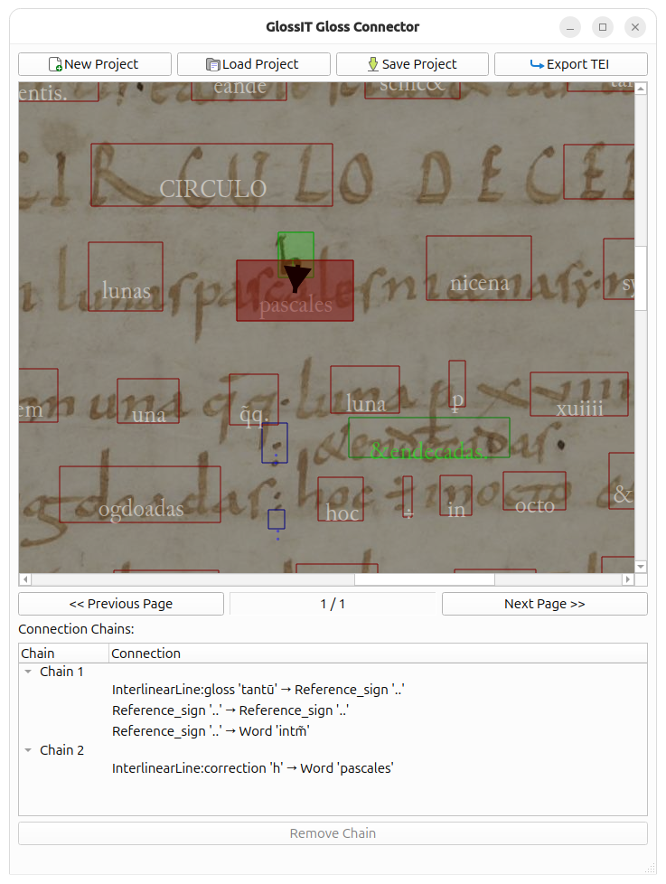

# GlossTools XML

## "Glossing together what belongs together."

Medieval manuscripts feature complex relationships between gloss lines, reference signs, and main text words.
This toolbox provides scripts and notebooks for checking and manipulating PageXML and TEI data.

## Funding Statement

This work is supported by ERC grant **GlossIT**, Grant Agreement Number 101123203‬. Funded by the European Union.
Views and opinions expressed are however those of the author(s) only and do not necessarily reflect those of the
European Union or the European Research Council Executive Agency. Neither the European Union nor the granting authority
can be held responsible for them.

## Table of Contents

0. [Preparing the Environment](#preparing-the-environment)
0. [Apply XSLT transformation to eScriptorium METS File](#apply-xslt-transformation-to-escriptorium-mets-file)
0. [METS Output Sanity Checks](#mets-output-sanity-checks)
0. [Connecting Glosses](#connecting-glosses)
   1. [GlossIT Gloss Connector GUI](#2-glossit-gloss-connector-gui)
   2. [Bulk Processing of Files](#4-bulk-processing-of-files)

## Preparing the Environment

1. Check that you are in the right directory, i.e., `notebooks/Tristan/XMLTools`.
2. Make a virtual environment with a `3.12.3` Python version (this requirement is due to the Kraken library) in your
   home directory, e.g.: `python -m venv .glossit`
3. Activate the environment with: `source ~/.glossit/bin/activate`
4. Install the requirements from this folder using pip: `pip install -r requirements.txt`
5. Install the Junicode font on your system from this page (or use a newer version):
   https://sourceforge.net/projects/junicode/files/junicode/junicode-1.002/junicode-1.002.zip/download
6. If necessary, delete the `matplotlib` font cache. It is usually a JSON file in the path `~/.cache/matplotlib`.

## Apply XSLT transformation to eScriptorium METS File

The eScriptorium METS file is transformed using an XSLT transformation in order to obtain a valid TEI file. To apply
an XSLT file to a METS file, the tool provides a command-line interface.

### How to Use

In the command line inside the `.glossit` environment, execute the command
`python main.py xslt --mets <path_to_mets_file> --xslt <path_to_xslt_file> --output-file <path_to_output_file>`, where
* `<path_to_mets_file>` is the path to the eScriptorium METS XML file.
* `<path_to_xslt_file>` is the path to the XSLT transformation.
* `<path_to_output_file>` is the path to the file where the transformed output should be saved. It is always saved as
  an XML file.

## METS Output Sanity Checks

### Description

Different objects inside the METS PageXML output must fulfill different properties to be valid. This concerns
properties such as object types and type descriptors, spatial relationship between objects such as lines or regions, or
the area an object spans. For the most important three types of *regions*, *main text lines* and *glosses*, we collect
features that we desire and automatically check if they are fulfilled, otherwise the user is notified with what is
suspicious and should be checked manually.

### Individual Checks

Check marks:
*  (CRITICAL)
  Those checks must never fail, as failure indicates severe errors.
*  (WARNING)
  Failing these checks indicates errors, but there may be perfectly fine 
  examples where the test fails.
*  (INFO)
  Failing such tests occurs very often even in fine examples, so it is to be
  taken as additional information.

1. *Regions* are areas inside a manuscript page that are characterized by polygons. The region types are collected in
   the class `pagexml_dataclasses.RegionType` below. For example, the region type `MarginTextZone:upper` defines the
   region that corresponds to the space above the area where the main text is written in. We check for the following:
    * 1a.  (CRITICAL)
      Check if the region type is actually valid, i.e., contained in the `RegionType` class.
    * 1b.  (CRITICAL)
      Check if no region type occurs more than once. The GlossIT TEI
      format defines that each region should be unique. (Except in double-page manuscripts such as Ang477).
    * 1c.  (WARNING)
      Check if the relative area of said region (i.e. the share of the 
      region's area in relation to the area of the whole page) is at least 0.1 %. Smaller areas are likely to be
      annotation errors.
    * 1d.  (INFO)
      Individual regions should not intersect with each other (even though
      there are exceptions) and thus may be suspicious.
2. *Main text lines* are objects that correspond to an individual line of the manuscript's main text. For this, only the
   types `LineType.DEFAULT` and `LineType.TITLE` are typically used. Let us check for these properties:
    * 2a.  (CRITICAL)
      Check if the text line type is actually one of `LineType.DEFAULT` or
      `LineType.TITLE`.
    * 2b.  (CRITICAL)
      Check if the line coordinates encompass an area greater than 0.
    * 2c.  (CRITICAL)
      Check if the lines contain any text.
    * 2d.  (CRITICAL)
      Check if the line width is greater than 60% of the average main text line width. (Excluding glosses that
      intersect with numbering zones.)
    * 2e.  (WARNING)
      Main text lines should mainly be inside main zone regions, i.e.,
      `RegionType.MAIN_ZONE`, `RegionType.MAIN_ZONE_COLUMN_LEFT`, or `RegionType.MAIN_ZONE_COLUMN_RIGHT`.
    * 2f.  (INFO)
      Usually, main text lines should intersect with exactly one region.
      However, in practice, text lines usually intersect with multiple regions.
3. *Glosses* are objects that directly correspond to a single line of a gloss. The individual gloss types are in the
   class `LineType`, excluding the two aforementioned main text types `LineType.DEFAULT` and `LineType.TITLE`. We check
   for following properties:
    * 3a.  (CRITICAL)
      Check if the gloss type is valid, i.e., contained in
     `pagexml_dataclasses.LineType` but not equal to the text line types `LineType.DEFAULT` or `LineType.TITLE`.
    * 3b  (CRITICAL)
      Check if the line coordinates encompass an area greater than 0.
    * 3c.  (CRITICAL)
      Check if glosses contain any text.
    * 3d.  (CRITICAL)
      Check if glosses in NumberingZones are arabic numerals.
    * 3f.  (CRITICAL)
      The width of gloss lines should be smaller than the average width of a text line. If it is longer than 60% of the
      average text line width, this should definitely be checked.
    * 3f.  (WARNING)
      Gloss lines should mainly be inside the correct region, i.e., interlinear gloss types should be in
      main zones (excluding intercolumnar zones), the marginal gloss type `LineType.MARGINAL_LINE_GLOSS` should only
      occur in the marginal zones, and the intercolumnar gloss type `LineType.INTERCOLUMNAR_LINE_GLOSS` should be in a
      region of type `RegionType.MAIN_ZONE_INTERCOLUMNAR`.
    * 3g.  (INFO)
      Also, gloss lines should usually intersect with exactly one region.
      However, in practice, gloss lines usually intersect with multiple regions.

### How to Use

In the command line inside the `.glossit` environment, execute the command
`python main.py sanity --mets <path_to_mets_file> --output-file <path_to_output_file>`, where
* `<path_to_mets_file>` is the path to the eScriptorium METS XML file.
* `<path_to_output_file>` is the path to the file where the sanity output checks should be saved. If not provided,
  the results are only displayed in the console. The script saves two outputs: A text-only output in the file
  `<path_to_output_file>.txt`, and a PDF including annotated images, where the suspicious regions are marked yellow
  (for warnings) or red (for critical errors) in the file `<path_to_output_file>.pdf`.

To display output of INFO checks, ` --info` at the end of above command, resulting in
`python main.py sanity --mets <path_to_mets_file> --output-file <path_to_output_file> --info`.

If you desire the output to be more detailed, add ` --verbose` at the end of above command, resulting in
`python main.py sanity --mets <path_to_mets_file> --output-file <path_to_output_file> --verbose`. This command
automatically displays verbose INFO checks.

In order to only conduct a subset of all checks, add the flags ` --region`, `--line`, or `--gloss` to perform only the
checks of the indicated groups. If no such flags are set, all checks are conducted by default.

In case you want the suspicious lines to be marked in the PageXML files, add ` --overwrite` at the end of above command,
resulting in `python main.py sanity --mets <path_to_mets_file> --output-file <path_to_output_file> --overwrite`. This
will then mark suspicious regions with an attribute corresponding to the result type, e.g., `sanity="critical"`.

## Connecting Glosses

### Description
Currently, the human annotators must follow a complicated manual workflow to annotate glosses. We differentiate between
two types of glosses: i) Direct glosses, i.e., glosses that refer to a word in the main text and are fully described by
this relationship; and ii) indirect glosses, where a gloss (usually as a marginal gloss) is connected to the word(s) it
refers to using a reference sign (usually an interlinear gloss above the word).

Direct glosses relationship: `Gloss -> Word(s)`

Indirect glosses relationship: `Gloss -> Reference Sign -> Word(s)`

For automatically connecting glosses, we divide the process into two steps:

1. **Word Bounding Box Detection:** In the eScriptorium output, the positions of individual lines are available, but the
   position of individual words is  not marked. How can we get the closest word to a gloss/reference sign automatically?
2. **Combine Glosses Based on Coordinates:** Since step 1 yielded bounding boxes for each word and also each gloss, how
   can we use this information to automatically combine the glosses/references that belong together?

### Annotation Process

1. The glosses and reference signs must be marked in eScriptorium.
2. Export the XML file from eScriptorium.
3. Connect the gloss/reference sign with the word(s) in the text it refers to using the attribute `target` and the
   unique word ID `xml:id` (e.g., `@target="#word1"` if the word has the id `word1`). Usually, the word the gloss is
   referring to is the closest in distance.
4. If in step 3 we had a direct gloss, we are done. Otherwise, find the gloss corresponding to the reference sign.
5. Connect the gloss to the reference sign and the unique gloss ID `xml:id` (e.g., `@target="#gl1"` if the gloss has the
   id `gl1`).

### 1. Word Bounding Box Detection

The annotated export from eScriptorium (PageXML and later XSLT transformations) provide line regions, but do **not**
provide word bounding boxes (*BB*). However, word BBs are necessary for the later step of automatically connecting
glosses with each other and with words in the main text. Our approach to automatically get word BB relies on running the
kraken model on the annotated pages, yielding positional information about each character, and then mapping the
(possibly divergent) kraken prediction with the annotated ground truth text to get character BB. The character BB are
then combined to get to word-level BB.

**For** each line:
1. Extract the line region from the PageXML.
2. Run kraken OCR on the line content.
3. From the kraken OCR, calculate the prediction cuts into character BBs.
4. Remove all spaces from both the PageXML ground truth content and the OCR prediction.
5. **If** the ground truth annotation is only one character, convert the whole line region into a line BB, which is then
   equal to the word BB. In this case, **continue** to the next line, as there is nothing more to do for this line.
6. **Otherwise** get the individual character BB:
    * 6a. **If** the OCR output from step 4 is empty (kraken has not recognized anything), take the whole line,
          calculate a line BB from it, and divide this rectangle into as many horizontally-equally spaced rectangles to
          approximate character bounding boxes.
    * 6b. **Otherwise**, match the PageXML ground truth and OCR prediction. Wherever equality or replacement of
          individual characters occurs, accept the character BB for the ground truth character.
7. Get the word BB:
    * 7a. **For** each word in the PageXML ground truth annotation, collect the character BB of each character that has
          such a BB. (In case no exact matching was possible, some characters might not have BB assigned to them.)
    * 7b. **If** for one of the words none of its characters has a valid BB, go to step 6a and continue from there.
    * 7c. **For** each word, combine the character BB into word BB as follows: The left/right margin of the BB is the
          leftmost/rightmost margin of any character BB. The top/bottom margin is the mean top/bottom margins for all
          character BB in this word.
8. Return the type of the line (e.g., `default` for main text lines, or `InterlinearLine:signe_de_renvoi` for Signe de
   Renvoi) and the individual words of this line including word BB.

### 2. GlossIT Gloss Connector GUI

To facilitate the connection of glosses/reference signs/main text words, the GlossIT Gloss Connector is the right tool!
It provides an intuitive graphical user interface for manual connection of glosses.

#### How to Use

`python main.py gloss-connector`

#### Known Bugs

*  (LOW PRIORITY)
  When creating projects with a large amount of manuscript pages, the ulimit may be insufficient. For example, on BB's
  mac, the ulimit is 256, so opening a manuscript with more pages results in an error. However, this may indicate that
  the files are not properly closed after reading (despite being encapsulated in a with statement), so this should be
  investigated thoroughly.
*  (LOW PRIORITY)
  Threaded functions cannot be called from within a threaded function. This will lead to a crash of the application.

### 3. Automatically Combining Glosses Based on Coordinates [Experimental]

#### Symbolic Rules

For trained humans, it is easy to detect with glosses/references/words belong together, at least in the majority of
cases. For computer systems, however, this task is not straightforward. To develop an algorithm that can automatically
connect glosses, we therefore must formalize typical positional arrangements of glosses and how they relate to them
being connected.

1. Glosses that directly refer to word(s) in the main text stand **always** above the word(s).
2. Reference signs that are connected with an interlinear gloss are connected with a **horizontal line**.
4. Reference signs that are connected always **bear the same sign**. In case of ambiguities, the reference signs that
   are **closest** form a pair.
5. In addition, if a marginal reference sign is connected to an interlinear reference sign, they are connected by a
   **horizontal line**.
6. Reference signs (connecting to interlinear Addition) that refer to the space between two words in the main text
   should link to the **right word**.
7. Signes de Renvoi are always bound to a word in te main text and can never be connected with a reference sign.

#### Algorithm

TBD

### How to Use

TBD

`python main.py auto-gloss --mets <path_to_mets_file> --tei <path_to_tei_file> --ocr-model <path_to_ocr_model> --output-file <path_to_output_file>`
* `<path_to_mets_file>` is the path to the eScriptorium METS XML file.
* `<path_to_tei_file>` is the path to the TEI file corresponding to the METS (typically obtained by applying the first
  XSLT transformation to the METS XML).
* `<path_to_ocr_model>` is the path to the Kraken OCR model (needed for automatically determining word boundaries).
* `<path_to_output_file>` is the path to where the PDF file containing the gloss connections should be saved.

### 4. Bulk Processing of Files

In our project workflow, we decided to have one separate GlossIT Connector GUI project file (*.glp) per manuscript page.
The bulk processing tools allow for an efficient three-step pipeline for transforming METS of large manuscripts into
single-page *.glp files.

To effectively create the *.glp files automatically, make sure that in your *input folder*, you have the following files
ready:
    * Complete METS file of the whole manuscript with the name `METS.xml`
    * Individual PageXML of manuscript pages as indicated by METS, e.g., `181_5da43_default.xml`
    * Individual image files (*.jpg) of manuscript pages as indicated by METS, e.g., `181_5da43_default.jpg`

The first bulk operation is *bulk-split-mets*. It takes the path to the input folder and splits the full `METS.xml`
into single-page METS for each individual manuscript page following the naming schema where the resulting file name
consists of the original PageXML/image filename with added `_METS.xml`, e.g., `181_5da43_default_METS.xml`.

The second bulk operation is *bulk-apply-xslt*. Given an input folder as prepared by `bulk-split-mets`, it takes all
files that end in `_METS.xml` (i.e., single-page METS files) and applies a given XSLT transformation to them. The XSLT
output for each single-page METS has a filename similar to the single-page METS, but with `_METS` replaced by `_TEI`.
E.g., the single-page METS `181_5da43_default_METS.xml` is transformed and saved as `181_5da43_default_TEI.xml`.

The third bulk operation is *bulk-create-glp*. Given an input folder as prepared by `bulk-apply-xslt`, it takes a
Kraken OCR *.mlmodel, and weaves it together with all corresponding `*_METS.xml` and `*_TEI.xml`, resulting in a *.glp
file. For example, it will take the PageXML `181_5da43_default_METS.xml` and the TEI file `181_5da43_default_TEI.jpg`
and makes a standalone *.glp file `181_5da43_default.glp` including word positions out of it. This file is then saved
into the input folder.

### How to Use

1. **bulk-split-mets**
   * `python main.py bulk-split-mets --input-folder <path_to_input_folder>`
   * `<path_to_input_folder>` is the path to the folder that contains a manuscript METS with the name `METS.xml`.
   
2. **bulk-apply-xslt**
   * `python main.py bulk-apply-xslt --input-folder <path_to_input_folder> --xslt <path_to_xslt_file>`
   * `<path_to_input_folder>` is the path to the folder that contains the pairs `<name>_METS.xml` and `<name>_TEI.xml`.
   * `<path_to_xslt_file>` is the path to the XSLT transformation.

3. **bulk-create-glp**
   * `python main.py bulk-create-glp --input-folder <path_to_input_folder> --ocr-model <path_to_ocr_model>`
   * `<path_to_input_folder>` is the path to the folder that contains the pairs `<name>_METS.xml` and `<name>_TEI.xml`.
   * `<path_to_ocr_model>` is the path to the Kraken OCR model (needed for automatically determining word boundaries).

